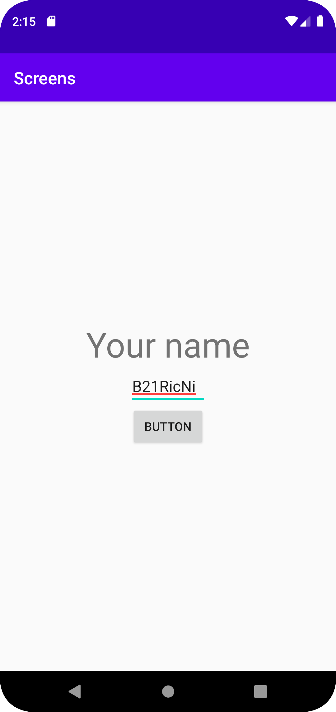
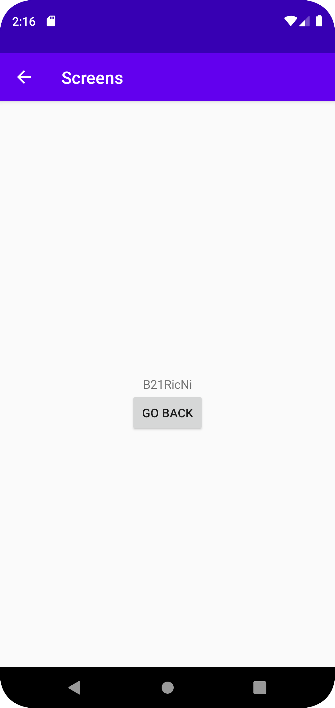

# Rapport

Först så lades log.d till för on start, stop ect. sedan så skapdes en login screen med text, ruta 
för att skriva namn och en knapp. Sedan så skapas klick hanterare genom att för skapa en knapp 
variable private Button signin;, och sedan så görs en findviewbyid på signin så man kan göra en
setonclick som fungerar. För att koppla knappen till MainActivity 2 så skapades intent.
Sedan så skapades en "go Back button" för att gå från Main activity 2 till Main activity 1 genom
att sätta intent på knappen att den ska stänga av aktivitenten(finish) som är aktivt. efter det så
lades text till för att få fram ett användarnamn, detta är gjort genom att skapa en edit text
variable och som tidigare så använder man findbyviewid för att koppla den till text rutan, och
för att testa att det fungera så loggades den med en +name.getText().toString(). När det fungerar så
skapas en intent.putExtra med get text funktionen och ger taggen ett id för att kunna skicka den 
till main activity2, sedan så lades det till i main activity 2 en intent funktion för att hämta
namnet och String name = extras.getString("name"); är slut funktionen som definerar id:et vi vill
hämta. För att visa namnet så skapades en textview name som sedan visas genom end findviewid på 
texten där den skall skrivas, sedan så skapas en showname.setText(name); vilket görs att texten 
visas på skärmen. 

```
    //MainActivity1
    private Button signin;
    private EditText name;
    ...
    ...
    ...
        name = findViewById(R.id.SignInName);

        signin = findViewById(R.id.SignInButton);
        signin.setOnClickListener(new View.OnClickListener() {
            @Override
            public void onClick(View view) {
                Log.d("==>", "onClick");
                Log.d("==>", "name: "+name.getText().toString());
                Intent intent = new Intent(MainActivity.this,MainActivity2.class);
                intent.putExtra("name",name.getText().toString());
                startActivity(intent);
            }
        });
        
    //MainActivity2
    private Button goback;
    private TextView showname;
    ...
    ...
    ...
        goback = findViewById(R.id.GoBackButton);
        showname = findViewById(R.id.ProfileLabel);

        Intent intent = getIntent();
        Bundle extras = intent.getExtras();

        String name = extras.getString("name");
        showname.setText(name);
        Log.d("==>","name from intent:" + name);

        goback.setOnClickListener(new View.OnClickListener() {
            @Override
            public void onClick(View view) {
                Log.d("==>","Go Back pressed");
                finish();
            }
        });
```

Bilder läggs i samma mapp som markdown-filen.




Läs gärna:

- Boulos, M.N.K., Warren, J., Gong, J. & Yue, P. (2010) Web GIS in practice VIII: HTML5 and the canvas element for interactive online mapping. International journal of health geographics 9, 14. Shin, Y. &
- Wunsche, B.C. (2013) A smartphone-based golf simulation exercise game for supporting arthritis patients. 2013 28th International Conference of Image and Vision Computing New Zealand (IVCNZ), IEEE, pp. 459–464.
- Wohlin, C., Runeson, P., Höst, M., Ohlsson, M.C., Regnell, B., Wesslén, A. (2012) Experimentation in Software Engineering, Berlin, Heidelberg: Springer Berlin Heidelberg.
